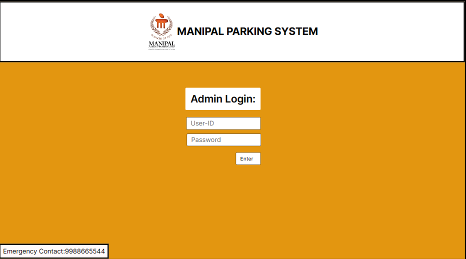
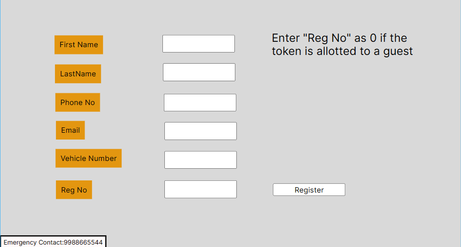

# DBMS-ParkingSystem

## ABSTRACT

Efficient and user-friendly parking systems are essential for maintaining a smooth and positive experience within any institution. Unfortunately, the current system at Manipal Institute of Technology (MIT) Bengaluru suffers from inefficiencies and user inconvenience, causing frustration and delays. To address these issues and enhance the overall experience for both students and staff, this project proposes the development of a novel parking management system.

## Table of Contents
+ [Abstract](#abstract)
+ [Table of Contents](#table-of-contents)
+ [Introduction](#introduction)
+ [Design and Implementation](#design-and-implementation)
+ [Result and Analysis](#result-and-analysis)
+ [Conclusion](#conclusion)

## Introduction

The existing parking system at Manipal Institute of Technology (MIT) Bengaluru is plagued by inefficiency and user inconvenience. This project seeks to address these shortcomings by proposing a novel parking management system built upon a robust technological foundation.

The proposed system leverages a backend architecture combining MySQL for database management, Node.js for core functionality and for a streamlined development experience. The user interface will be built using HTML, CSS, and JavaScript, ensuring a user-friendly and accessible experience.

This project aims to significantly improve the efficiency and convenience of the MIT Bengaluru parking system, providing a positive impact on both students and staff.

## Design and Implementation
### System Design
#### User Interface (UI) Design:

#### Database Design:
ER Model

* Admin Table(**admin_id** , password)
* Registration Table(**reg_id** , first_name , last_name , email , phone_no , entry_type , **vehicle_no**)
* Token Table(**token_id** , parking_slot , ***reg_id*** , ***vehicle_no*** , entry_time)
### System Implementation

#### Backend Architecture:
Leveraging Java for backend logic.
Employing the Spring framework for modular and scalable development.
Admin login functionality for secure user authentication.

#### Data Management:
Integration of MySQL for efficient storage and retrieval of parking-related data.

##### Admin Table:
+ Manages administrator credentials for system access.

##### Registration Table:
+ Stores user registration details, including students, faculty, and guests.

##### Token Table:
+ Records parking tokens and related information, linking to user registrations.

#### Token Generation Logic:
Designing a systematic approach to generate parking tokens during user registration.
Implementing algorithms for dynamic parking space allocation based on availability.

#### Exit Process Mechanism:
Validating user tokens during the parking exit process.
Executing procedures to release parking spaces and update the database.
Handling optional deletion of guest user entries.

## Result and Analysis

## Conclusion

